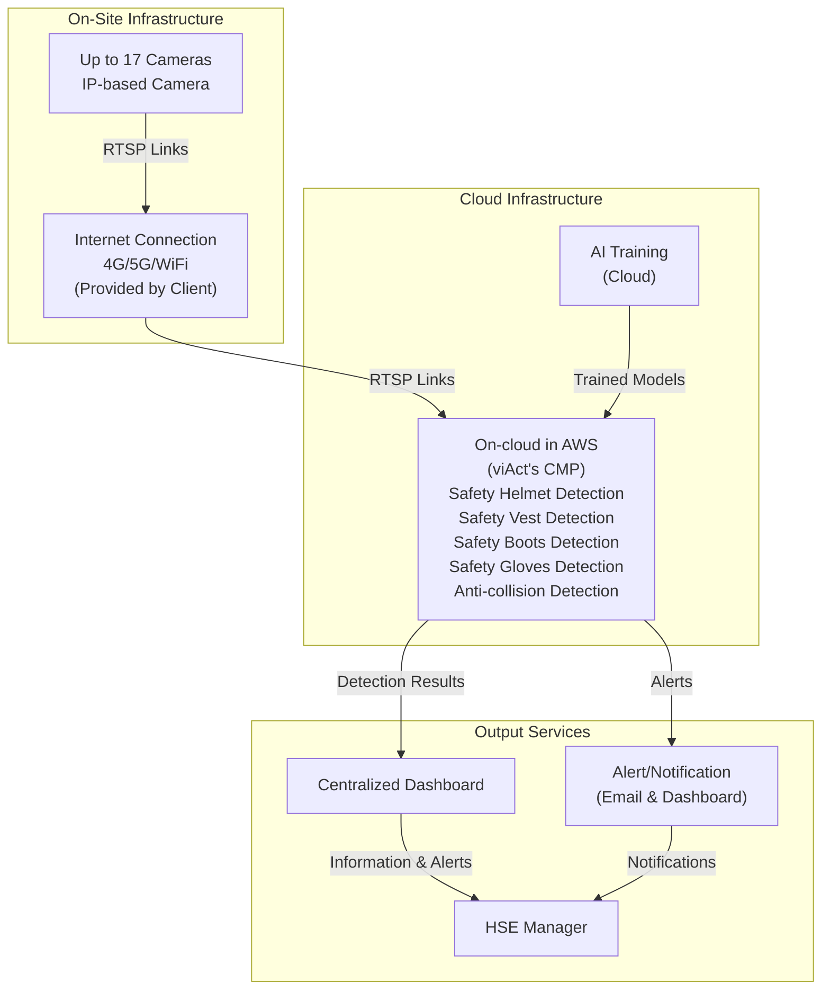

# Architecture Generator Skill

## Overview

This skill generates System Architecture Mermaid diagrams from proposal templates (created by proposal-template-generation-skill). The output matches the clean, client-friendly format used in actual proposal slides from the KB, showing only essential components and flow.

## Resources Available

This skill includes the following resources (loaded as needed):

- **ARCHITECTURE_TEMPLATES.md**: Architecture patterns from KB examples - Contains templates for Cloud, On-premise, and Hybrid architectures
- **scripts/parse_proposal.py**: Parse proposal template to extract architecture information
- **scripts/generate_mermaid.py**: Generate Mermaid diagram matching KB structure

## When to Use This Skill

Use this skill when:
- User provides a proposal template file (from proposal-template-generation-skill)
- User asks to generate system architecture diagram
- User mentions "architecture", "system architecture", "architecture diagram"
- Proposal template is ready and needs architecture diagram

## Process

### Step 1: Parse Proposal Template

Read the proposal template markdown file and extract:
- **Project Name**: From proposal title
- **Client Name**: From project requirement statement
- **Camera Number**: From "Camera Number:" field
- **AI Modules**: List from "AI Modules:" section
- **Deployment Method**: From "SYSTEM ARCHITECTURE" section (Cloud/On-premise/Hybrid)
- **Alert Methods**: From "Alerts & Notifications" section
- **NVR Requirement**: Check if NVR is mentioned or needed

**How to parse:**
1. Use `scripts/parse_proposal.py` to extract information
2. Reference ARCHITECTURE_TEMPLATES.md for structure
3. Match deployment method to appropriate template

### Step 2: Generate Architecture Diagram

Generate Mermaid diagram following KB examples structure:

**Key Principles:**
1. **Simple Flow**: Camera → (NVR optional) → RTSP Links → AI System → Dashboard & Alert
2. **No Internal Details**: Don't show DB, API Gateway, Auth Service (internal implementation)
3. **List AI Modules**: Show all modules with full names (no M1:, M2: prefixes)
4. **NVR Optional**: Only show NVR when needed, mark as (NVR)*
5. **No Router/Switch**: Unless explicitly required
6. **Clean Layout**: Match KB examples structure

### Step 3: Match KB Architecture Patterns

Reference KB "DOCUMENT" dataset for architecture patterns:

**Cloud Architecture Pattern:**
```
On-Site:
  - Cameras
  - (NVR)* optional
  - Internet Connection

Cloud:
  - AI Training (Cloud)
  - On-cloud in AWS (viAct's CMP) with AI modules inside

Output Services (separate subgraph - client-accessible):
  - Centralized Dashboard
  - Alert/Notification
  - HSE Manager

AI Modules:
  - List all modules with full names (embedded in Cloud Inference)

Flow:
  Camera → (NVR) → RTSP Links → Internet → Cloud Processing → Output Services (Dashboard & Alert) → HSE Manager
```

**On-Premise Architecture Pattern:**
```
On-Site:
  - Cameras
  - (NVR)* optional
  - AI Modules (On-Premise Processing)
  - Local Dashboard
  - Alert System

AI Modules:
  - List all modules with full names

Flow:
  Camera → (NVR) → RTSP Links → AI System → Dashboard & Alert
```

**Hybrid Architecture Pattern:**
```
On-Site:
  - Cameras
  - (NVR)* optional
  - AI Modules (On-Premise Processing)
  - Local Dashboard
  - Internet Connection

Cloud:
  - viAct's Cloud (AI Model Training)
  - Online Dashboard
  - Alert System

AI Modules:
  - List all modules with full names
```

### Step 4: Generate Output

Create `[Project_Name]_architecture_diagram.md` with:
- Clean Mermaid diagram code
- Matching KB examples structure
- All AI modules listed (full names)
- Essential flow only
- Client-friendly format

## Architecture Structure Rules

### Components to Include

✅ **Always Include:**
- Cameras (with count: "Up to X Cameras")
- AI System/Cloud Processing
- Dashboard (Local or Online)
- Alert System
- HSE Manager (for cloud deployments)
- AI Modules list (all modules with full names)

✅ **Conditionally Include:**
- NVR: Only if mentioned or for on-premise (mark as optional with *)
- Internet Connection: For cloud/hybrid deployments

❌ **Never Include:**
- Database (internal detail)
- API Gateway (internal detail)
- Authentication Service (internal detail)
- Router/Switch details (unless explicitly needed)
- Workstation specs in diagram (keep it simple)

### AI Modules Display

- **List all modules** with full names
- **No prefixes**: Don't use "M1:", "M2:", etc.
- **Clean names**: Use exact module names from proposal
- **Group in subgraph**: "AI Modules" subgraph
- **Connect to AI System**: Show connection from AI System to modules

### Flow Structure

**Standard Flow:**
```
Camera → (NVR optional) → RTSP Links → AI System → Dashboard & Alert
```

**Cloud Flow:**
```
Camera → (NVR optional) → RTSP Links → Internet → Cloud Processing → Dashboard & Alert
```

**On-Premise Flow:**
```
Camera → (NVR optional) → RTSP Links → AI Processing → Local Dashboard & Alert
```

## Output Format

Generate a single file: `[Project_Name]_architecture_diagram.md`

**File Structure:**
```markdown
# System Architecture: [Project Name]

**Client:** [Client Name]
**Deployment Method:** [CLOUD/ON-PREMISE/HYBRID]
**Cameras:** [Number]
**AI Modules:** [Count]

---

## Architecture Diagram

```mermaid
[Generated Mermaid code matching KB examples]
```
```

## Using Resources

- **When you need architecture patterns**: Read `ARCHITECTURE_TEMPLATES.md` to see KB examples
- **When parsing proposal**: Use `scripts/parse_proposal.py` to extract information
- **When generating diagram**: Use `scripts/generate_mermaid.py` to create Mermaid code
- **When checking KB examples**: Search KB "DOCUMENT" dataset for "system architecture"

## Important Rules

### 1. Match KB Examples
- Always reference KB "DOCUMENT" dataset for architecture patterns
- Follow the same structure and layout as proposal slides
- Keep it simple and client-friendly

### 2. Essential Information Only
- Show only what clients need to understand the flow
- Hide internal implementation details
- Focus on: Camera → Processing → Dashboard & Alert

### 3. AI Modules
- List all modules with full names
- No prefixes or numbering
- Group in "AI Modules" subgraph
- Connect to AI System/Cloud Processing

### 4. NVR Handling
- Show NVR only when needed
- Mark as optional: (NVR)*
- For cloud: Usually hidden
- For on-premise: Usually shown (but optional)

### 5. Clean Layout
- Use subgraphs for organization
- Keep connections simple
- Match KB examples layout
- Professional and readable

## Example Output

**Cloud Architecture:**


## Quality Check

Before finalizing, verify:
- ✅ Matches KB architecture examples structure
- ✅ Shows essential flow only (Camera → Processing → Output Services → HSE Manager)
- ✅ All AI modules listed with full names (embedded in Cloud Inference for compact mode)
- ✅ Output Services (Dashboard, Alert, HSE Manager) grouped in separate subgraph
- ✅ NVR shown only when needed (marked optional)
- ✅ No internal details (DB, API Gateway, Auth Service)
- ✅ Clean, client-friendly format
- ✅ Proper subgraph organization

