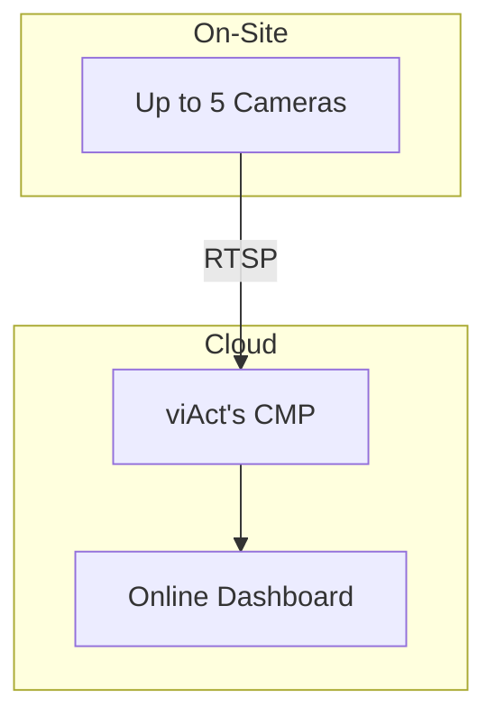

# Testing Guide: Slide Content Mapper

## 🧪 Testing Overview

Guide này hướng dẫn cách test `slide-content-mapper` skill từng bước, đảm bảo mapping từ proposal template (markdown) sang slide structure (JSON) hoạt động chính xác.

---

## 📋 Prerequisites

### 1. Setup Environment

```bash
# Navigate to skill directory
cd slide-content-mapper

# Ensure Python 3.7+ is installed
python3 --version

# Install dependencies (if needed)
pip3 install -r requirements.txt  # Create if needed
```

### 2. Prepare Test Files

**Test Input Files**:
- `test_proposal_template.md`: Sample proposal template để test
- `test_architecture_diagram.md` (optional): Architecture diagram để test diagram mapping

**Expected Output Files**:
- `test_proposal_template_slide_structure.json`: Generated slide structure
- `test_proposal_template_slide_content.md`: Human-readable summary

---

## 🧪 Test Cases

### Test Case 1: Basic Mapping (Minimal Proposal)

**Purpose**: Test mapping với proposal đơn giản nhất, đảm bảo các slide cơ bản được tạo.

**Test File**: `tests/test_basic_proposal.md`

**Content**:
```markdown
# Test Proposal - Basic

## 1. COVER PAGE

| Content | Source/Guidance |
|---------|------------------|
| Proposal Title | Video Analytics Solution Proposal for Test Client |
| Client Name | Test Client |
| Date | 2025-01-15 |

## 2. PROJECT REQUIREMENT STATEMENT

| Content | Source/Guidance |
|---------|------------------|
| **Project** | AI-Powered Video Analytics for Safety Monitoring |
| **Project Owner** | Test Client |
| **Work Scope** | Implement AI-based video analytics system |
| **Project Duration** | 3 months |
| **Camera Number** | 5 cameras |
| **AI Modules** | Safety Helmet Detection |

## 3. SCOPE OF WORK

**viAct Responsibilities:**
- Software: license, maintenance, support
- Camera integration

**Client Responsibilities:**
- Hardware: Procurement, configuration
- Network infrastructure

## 4. SYSTEM ARCHITECTURE

Cloud deployment method.

## 5. SYSTEM REQUIREMENTS

### Network
- External bandwidth: 20 Mbps
- Per-camera bandwidth: 12 Mbps
- Internal LAN: Gigabit Ethernet recommended

### Workstation

#### Inference Workstation
- CPU: Intel i5 or above
- RAM: 8GB or higher
- Storage: 256GB SSD
- OS: Windows 10 or Ubuntu 20.04 LTS

#### Dashboard Server
- CPU: Intel i3 or above
- RAM: 4GB or higher
- Storage: 128GB SSD
- Web server required (Apache/Nginx)
- OS: Windows Server 2019 or Ubuntu 20.04 LTS

#### Training Workstation
- Not required for this deployment (pre-trained models provided, no on-site retraining)

### Camera
- Type: IP Camera (ONVIF-compatible)
- Resolution: 1080p (Full HD) or above
- Quantity: 5 units

### Additional Requirements
- Power backup (UPS) for critical systems
- Secure environment for server hardware
- User laptops/desktops with Chrome/Edge for dashboard access

## 6. IMPLEMENTATION PLAN (TIMELINE)

**Phase T0**: Project awarded
**Phase T1**: Hardware deployment finish (T0 + 2-4 weeks)

## 7. PROPOSED MODULES & FUNCTIONAL DESCRIPTION

Module: Safety Helmet Detection  
Module Type: Standard

Purpose: Detects workers without safety helmet.

## 8. USER INTERFACE & REPORTING

### Alerts & Notifications
- Email alerts
- Dashboard notifications
```

**Expected Output**:
- ✅ Slide 1: Cover Page (title slide)
- ✅ Slide 2: Project Requirement Statement (table format)
- ✅ Slide 3: Scope of Work (two-column)
- ✅ Slide 5: System Architecture (diagram slide, even if no diagram)
- ✅ Slide 7: System Requirements: Network (bullets or table)
- ✅ Slide 11: Implementation Plan (timeline)
- ✅ Slide 13: Module description
- ✅ Slide 21: Alerts & Notifications

**Test Command**:
```bash
python3 scripts/map_to_slides.py tests/test_basic_proposal.md tests/output/
```

**Verify**:
```bash
# Check JSON output
cat tests/output/test_basic_proposal_slide_structure.json | python3 -m json.tool

# Check summary
cat tests/output/test_basic_proposal_slide_content.md
```

**Assertions**:
- [ ] JSON file is valid JSON
- [ ] `total_slides` >= 8
- [ ] Slide 1 type is "title"
- [ ] Slide 2 type is "content_table"
- [ ] Slide 3 type is "two_column"
- [ ] All required sections are mapped

---

### Test Case 2: Complete Proposal (Real-like)

**Purpose**: Test với proposal đầy đủ, giống proposal thực tế.

**Test File**: Use existing proposal template từ `outline-template-generation-skill` output hoặc `01_test/Cedo_template.md`

**Test Command**:
```bash
# Test với proposal có sẵn (không có architecture diagram)
python3 scripts/map_to_slides.py ../01_test/Cedo_template.md "" tests/output/

# Nếu có architecture diagram
python3 scripts/map_to_slides.py ../01_test/Cedo_template.md ../01_test/Cedo_template_architecture_diagram.md tests/output/
```

**Expected Output**:
- ✅ Tất cả 8 sections được map
- ✅ Slide numbering liên tục (1, 2, 3...)
- ✅ Module slides được group hợp lý
- ✅ Architecture diagram được reference (nếu có)
- ✅ Total slides: ~20-30 slides

**Verify**:
```bash
# Count total slides
cat tests/output/Cedo_template_slide_structure.json | python3 -c "import json, sys; d=json.load(sys.stdin); print(f\"Total slides: {d['total_slides']}\")"

# Check slide types
cat tests/output/Cedo_template_slide_structure.json | python3 -c "import json, sys; d=json.load(sys.stdin); [print(f\"Slide {s['slide_number']}: {s['type']}\") for s in d['slides']]"

# Verify all sections mapped
python3 tests/verify_mapping.py tests/output/Cedo_template_slide_structure.json
```

---

### Test Case 3: Architecture Diagram Integration

**Purpose**: Test mapping với architecture diagram file.

**Test File**: Create test architecture diagram:

**Content** (`tests/test_architecture.md`):
```markdown
# System Architecture


```

**Test Command**:
```bash
python3 scripts/map_to_slides.py tests/test_basic_proposal.md tests/test_architecture.md tests/output/
```

**Verify**:
- [ ] Slide 5 (diagram slide) có `diagram.code` không rỗng
- [ ] Mermaid code được extract correctly
- [ ] Diagram type là "mermaid"

---

### Test Case 4: Module Grouping

**Purpose**: Test việc group modules theo category.

**Test File**: Proposal với nhiều modules:

```markdown
## 7. PROPOSED MODULES & FUNCTIONAL DESCRIPTION

Module: Safety Helmet Detection
Module Type: Standard

Module: Safety Vest Detection
Module Type: Standard

Module: Safety Boots Detection
Module Type: Standard

Module: People Counting
Module Type: Standard
```

**Expected Output**:
- ✅ PPE modules grouped vào "PPE Detection" group
- ✅ Operations modules grouped vào "Operations" group
- ✅ Mỗi module có slide riêng hoặc group trên cùng slide

**Verify**:
```python
# Check module slides
slides = json.load(open("output.json"))
module_slides = [s for s in slides["slides"] if s["type"] == "module_description"]
print(f"Module slides: {len(module_slides)}")
for slide in module_slides:
    print(f"  - {slide['title']}")
```

---

### Test Case 5: Two-Column Slide

**Purpose**: Test Scope of Work mapping thành two-column slide.

**Verify**:
```python
# Check two-column slide
slides = json.load(open("output.json"))
scope_slide = [s for s in slides["slides"] if s["type"] == "two_column"][0]

assert "left_column" in scope_slide
assert "right_column" in scope_slide
assert "viAct" in scope_slide["left_column"]["title"]
assert "Client" in scope_slide["right_column"]["title"]
print("✅ Two-column slide correctly formatted")
```

---

### Test Case 6: Timeline Extraction

**Purpose**: Test extraction và formatting của timeline milestones.

**Verify**:
```python
# Check timeline slide
slides = json.load(open("output.json"))
timeline_slide = [s for s in slides["slides"] if s["type"] == "timeline"][0]

assert "timeline" in timeline_slide
assert "milestones" in timeline_slide["timeline"]
assert len(timeline_slide["timeline"]["milestones"]) > 0

print("Timeline milestones:")
for milestone in timeline_slide["timeline"]["milestones"]:
    print(f"  {milestone['phase']}: {milestone['event']} - {mileline['date']}")
```

---

### Test Case 7: Error Handling

**Purpose**: Test error handling với invalid inputs.

**Test Cases**:
1. **Missing file**:
   ```bash
   python3 scripts/map_to_slides.py nonexistent.md
   # Expected: Error message, exit code != 0
   ```

2. **Invalid markdown**:
   ```bash
   python3 scripts/map_to_slides.py tests/test_invalid.md
   # Expected: Graceful handling, partial output or error
   ```

3. **Empty file**:
   ```bash
   python3 scripts/map_to_slides.py tests/test_empty.md
   # Expected: Error or empty structure
   ```

**Verify**:
- [ ] Script không crash
- [ ] Error messages rõ ràng
- [ ] Exit code != 0 khi error

---

## 🛠️ Test Scripts

### Script 1: Verify Mapping (`tests/verify_mapping.py`)

```python
#!/usr/bin/env python3
"""
Verify slide structure JSON mapping correctness
"""

import json
import sys
from pathlib import Path


def verify_structure(json_file: str) -> bool:
    """Verify slide structure JSON"""
    with open(json_file, 'r', encoding='utf-8') as f:
        data = json.load(f)
    
    errors = []
    
    # Check required fields
    required_fields = ["project_name", "client_name", "total_slides", "slides"]
    for field in required_fields:
        if field not in data:
            errors.append(f"Missing required field: {field}")
    
    # Check slides
    if "slides" in data:
        slides = data["slides"]
        
        # Check numbering
        slide_numbers = [s.get("slide_number") for s in slides]
        expected_numbers = list(range(1, len(slides) + 1))
        if slide_numbers != expected_numbers:
            errors.append(f"Slide numbering incorrect: {slide_numbers} vs {expected_numbers}")
        
        # Check each slide has required fields
        for slide in slides:
            if "slide_number" not in slide:
                errors.append(f"Slide missing slide_number: {slide}")
            if "type" not in slide:
                errors.append(f"Slide missing type: {slide}")
            if "title" not in slide:
                errors.append(f"Slide missing title: {slide}")
        
        # Check total matches
        if data.get("total_slides") != len(slides):
            errors.append(f"total_slides ({data.get('total_slides')}) != actual count ({len(slides)})")
    
    # Report
    if errors:
        print("❌ Errors found:")
        for error in errors:
            print(f"  - {error}")
        return False
    else:
        print("✅ All checks passed!")
        return True


if __name__ == "__main__":
    if len(sys.argv) < 2:
        print("Usage: python verify_mapping.py <slide_structure.json>")
        sys.exit(1)
    
    json_file = sys.argv[1]
    success = verify_structure(json_file)
    sys.exit(0 if success else 1)
```

**Usage**:
```bash
python3 tests/verify_mapping.py tests/output/test_slide_structure.json
```

---

### Script 2: Compare Output (`tests/compare_output.py`)

```python
#!/usr/bin/env python3
"""
Compare two slide structure JSON files
"""

import json
import sys
from pathlib import Path


def compare_json(file1: str, file2: str):
    """Compare two JSON files"""
    with open(file1, 'r') as f:
        data1 = json.load(f)
    
    with open(file2, 'r') as f:
        data2 = json.load(f)
    
    # Compare basic fields
    print("Comparing:")
    print(f"  File 1: {file1}")
    print(f"  File 2: {file2}\n")
    
    print(f"Total Slides:")
    print(f"  File 1: {data1.get('total_slides')}")
    print(f"  File 2: {data2.get('total_slides')}")
    
    print(f"\nProject Names:")
    print(f"  File 1: {data1.get('project_name')}")
    print(f"  File 2: {data2.get('project_name')}")
    
    # Compare slide types
    if "slides" in data1 and "slides" in data2:
        types1 = [s.get("type") for s in data1["slides"]]
        types2 = [s.get("type") for s in data2["slides"]]
        
        print(f"\nSlide Types:")
        print(f"  File 1: {types1}")
        print(f"  File 2: {types2}")
        
        if types1 == types2:
            print("✅ Slide types match!")
        else:
            print("❌ Slide types differ")


if __name__ == "__main__":
    if len(sys.argv) < 3:
        print("Usage: python compare_output.py <file1.json> <file2.json>")
        sys.exit(1)
    
    compare_json(sys.argv[1], sys.argv[2])
```

---

### Script 3: Visualize Slide Structure (`tests/visualize_structure.py`)

```python
#!/usr/bin/env python3
"""
Visualize slide structure as text tree
"""

import json
import sys


def visualize(json_file: str):
    """Print slide structure as tree"""
    with open(json_file, 'r') as f:
        data = json.load(f)
    
    print(f"📊 Slide Structure: {data.get('project_name')}")
    print(f"   Client: {data.get('client_name')}")
    print(f"   Total Slides: {data.get('total_slides')}\n")
    
    for slide in data.get("slides", []):
        slide_num = slide.get("slide_number", "?")
        slide_type = slide.get("type", "unknown")
        slide_title = slide.get("title", "Untitled")
        
        print(f"  {slide_num:2d}. [{slide_type:20s}] {slide_title}")
        
        # Show content preview
        if "table" in slide:
            rows = slide["table"].get("rows", [])
            print(f"      └─ Table: {len(rows)} rows")
        elif "content" in slide:
            items = slide["content"]
            if isinstance(items, list):
                print(f"      └─ Bullet points: {len(items)} items")
        elif "diagram" in slide:
            diagram = slide["diagram"]
            if diagram.get("code"):
                print(f"      └─ Diagram: Mermaid code present")
            else:
                print(f"      └─ Diagram: No code")


if __name__ == "__main__":
    if len(sys.argv) < 2:
        print("Usage: python visualize_structure.py <slide_structure.json>")
        sys.exit(1)
    
    visualize(sys.argv[1])
```

**Usage**:
```bash
python3 tests/visualize_structure.py tests/output/test_slide_structure.json
```

---

## 📝 Test Checklist

Khi test, verify:

### Functionality
- [ ] Script chạy không lỗi
- [ ] JSON output là valid JSON
- [ ] Tất cả sections từ TEMPLATE.md được map
- [ ] Slide numbering liên tục (1, 2, 3...)
- [ ] Slide types đúng với content

### Content Mapping
- [ ] Cover Page → Slide 1 (title)
- [ ] Project Requirement → Slide 2 (table/bullets)
- [ ] Scope of Work → Slide 3 (two-column)
- [ ] System Architecture → Slide 5 (diagram)
- [ ] System Requirements → Slide 7-10 (multiple)
- [ ] Implementation Plan → Slide 11 (timeline)
- [ ] Modules → Slide 13+ (module descriptions)
- [ ] UI & Reporting → Slide 21+ (content)

### Data Quality
- [ ] Content không có markdown syntax còn sót
- [ ] Bullet points có đúng levels
- [ ] Tables format đúng
- [ ] Key-value pairs extract đúng
- [ ] Module grouping hợp lý

### Error Handling
- [ ] Missing file → Error message
- [ ] Invalid markdown → Graceful handling
- [ ] Missing architecture diagram → Still works
- [ ] Empty sections → Handled correctly

---

## 🚀 Quick Test Run

```bash
# 1. Create test directory
mkdir -p tests/output

# 2. Run basic test (không có architecture diagram)
python3 scripts/map_to_slides.py tests/test_basic_proposal.md "" tests/output/

# 3. Verify output
python3 tests/verify_mapping.py tests/output/test_basic_proposal_slide_structure.json

# 4. Visualize
python3 tests/visualize_structure.py tests/output/test_basic_proposal_slide_structure.json

# 5. Test with real proposal (không có architecture diagram)
python3 scripts/map_to_slides.py ../01_test/Cedo_template.md "" tests/output/

# 6. Compare outputs (if needed)
python3 tests/compare_output.py tests/output/test_basic_proposal_slide_structure.json tests/output/Cedo_slide_structure.json
```

---

## 📊 Expected Results

**Test Case 1** (Basic):
- ✅ Total slides: ~8-10 slides
- ✅ Slide types: title, content_table, two_column, diagram, content_bullets, timeline, module_description
- ✅ All sections mapped

**Test Case 2** (Complete):
- ✅ Total slides: ~20-30 slides
- ✅ Module slides: 1 per module hoặc grouped
- ✅ System Requirements: Multiple slides (Network, Camera, Workstations)

---

## 🔍 Debugging Tips

### If mapping fails:

1. **Check markdown parsing**:
   ```python
   # Add debug prints in map_to_slides.py
   print(f"Sections found: {list(sections.keys())}")
   ```

2. **Check content extraction**:
   ```python
   # Check if content is extracted correctly
   print(f"Section content length: {len(section_content)}")
   ```

3. **Check JSON output**:
   ```bash
   # Validate JSON
   python3 -m json.tool output.json > /dev/null && echo "✅ Valid JSON"
   ```

4. **Visualize structure**:
   ```bash
   # Use visualize script
   python3 tests/visualize_structure.py output.json
   ```

---

## ✅ Success Criteria

Test passed khi:
- ✅ Tất cả test cases chạy không lỗi
- ✅ JSON output valid và structure đúng
- ✅ Tất cả sections được map
- ✅ Slide numbering đúng
- ✅ Content format đúng (không có markdown syntax)
- ✅ Error handling hoạt động

