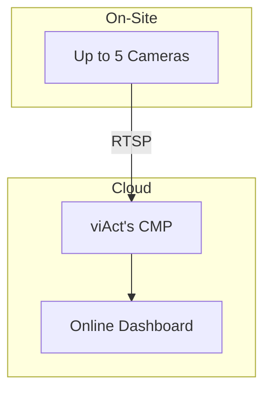

# System Architecture

```mermaid
graph TB
    subgraph "On-Site"
        Cameras["Up to 5 Cameras"]
    end
    
    subgraph "Cloud"
        Cloud_AI["viAct's CMP"]
        Dashboard["Online Dashboard"]
    end
    
    Cameras -->|RTSP| Cloud_AI
    Cloud_AI --> Dashboard
```

