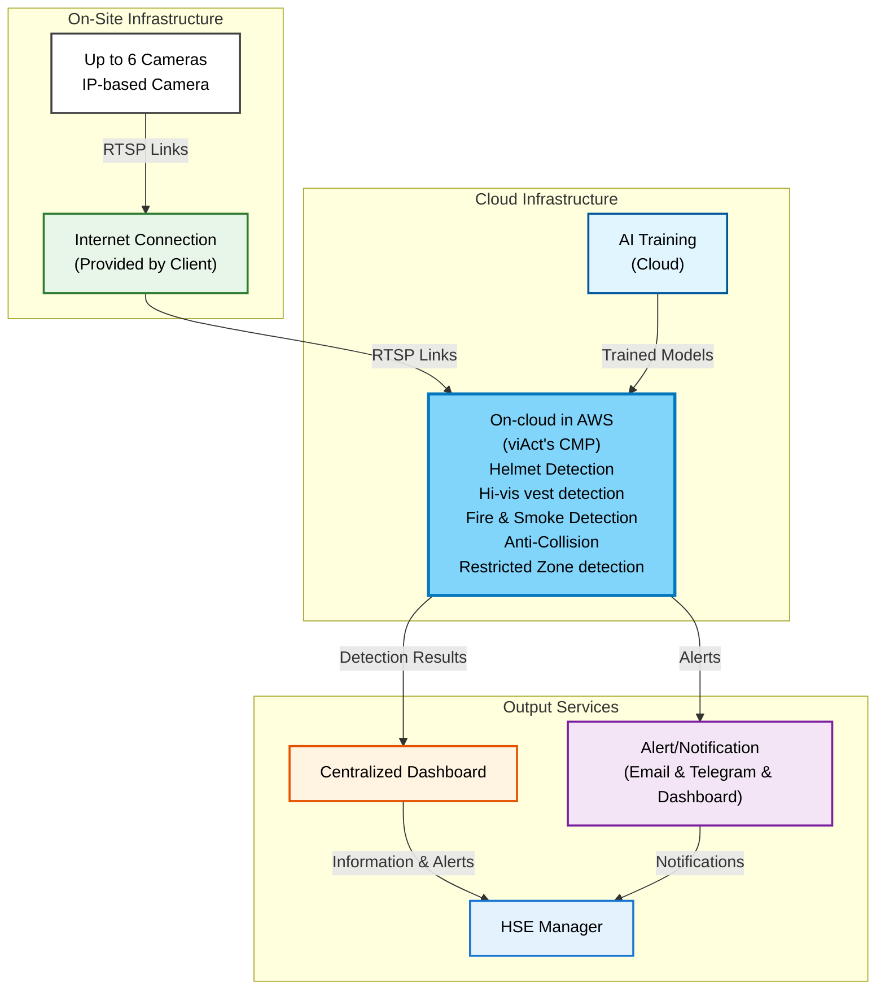

# System Architecture: Video Analytics Solution Proposal for AVA Project - Nas Ltd

**Client:** AVA Project - Nas Ltd
**Deployment Method:** CLOUD
**Cameras:** 6
**AI Modules:** 5

---

## Architecture Diagram

